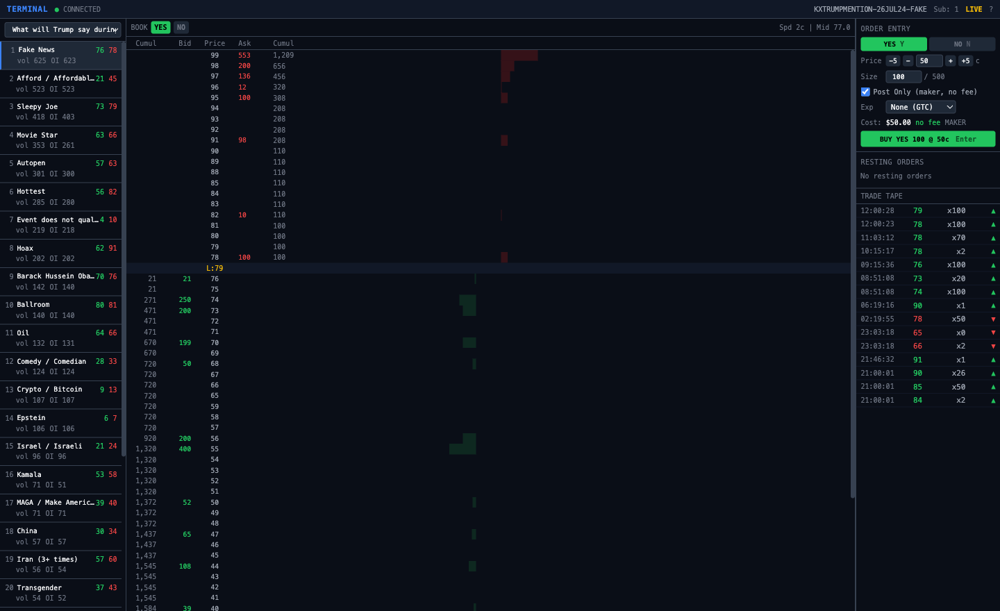

# Trading Terminal

A local web terminal for trading Kalshi prediction markets. It runs locally,
talks to the Kalshi API, and displays live order book,the order ticket, and resting
orders on one screen. Includes keyboard shortcuts for quick trading. 

Kalshi API keys stay on the local backend.



## What it does

- Live order book ladder over WebSocket. Top-of-book streams in (coalesced to 10/sec);
  full depth is polled from REST.
- Click a price level to load it into the order ticket.
- Keyboard order entry: set side, price, size, and send without the mouse.
- Resting orders with one-key cancel, and cancel-all by market or by event.
- Live trade tape.
- Market list that pulls open events and shows your position in each.
- Demo or live, with subaccount support.

## Orders

- Post-only (maker) or crossing (taker).
- Time in force: GTC, 10 minutes, end of day (4pm ET), event start, or a custom number
  of minutes.

## Stack

FastAPI backend wrapping the Kalshi REST/WebSocket API via
[pykalshi](https://pypi.org/project/pykalshi/); SvelteKit + TypeScript + Tailwind
frontend.

## Setup

```bash
git clone https://github.com/jsteng19/trading-terminal.git
cd trading-terminal

python -m venv .venv && source .venv/bin/activate
pip install -e .

cp .env.example .env          # add KALSHI_API_KEY_ID + KALSHI_PRIVATE_KEY_PATH

cd frontend && npm install && npm run build && cd ..   # backend serves the build

python run.py                 # opens http://127.0.0.1:8766
```

## Keyboard shortcuts

| Key | Action |
|-----|--------|
| `Y` / `N` | Set side YES / NO |
| `↑` / `↓` | Price ±1¢ |
| `Shift+↑` / `Shift+↓` | Price ±5¢ |
| `]` / `[` | Size ± increment |
| `Enter` | Place order |
| `Esc` | Cancel all on current market |
| `Shift+Esc` | Cancel all in event |
| `Tab` / `Shift+Tab` | Next / previous market |
| `1`–`9` | Quick-select market |
| `?` | Toggle shortcut help |

## Config

Defaults (max order size, default size, increment) live in `configs/defaults.yaml`.

## Future Features

- Portfolio page for managing open positions, with live mark-to-market PnL
- Ladder orders (size resting across multiple price levels)
- Amend resting orders in place instead of cancel/replace
- Batch orders across multiple markets
